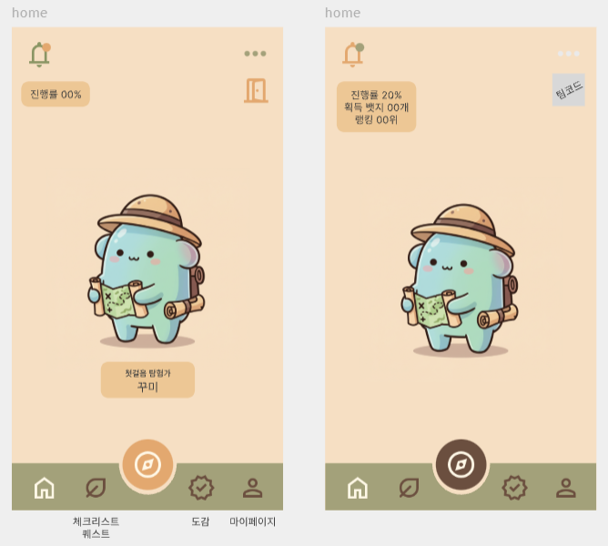

# 문방구 (문화재 탐방 친구)

> <b>"초등학생과 인솔자를 위한 교육용 문화재 탐방 어플"</b>

## 1. 소개

현장학습에서 `학생`들은 <b>사진 인증의 번거로움, 단순 관람과 불분명한 학습 목적으로 인한 <u>지루함을 호소</u></b>하고 있으며, `인솔자`들은 <b><u>실시간 활동 현황 파악의 어려움과 체계적인 관리 도구의 부재</u></b>로 고민하고 있습니다. 이러한 문제를 해결하고자 GPS 위치 서비스와 게임적 요소를 접목한 새로운 교육용 앱을 기획하게 되었습니다. 학생들은 퀴즈와 미션을 해결하며 문화재를 즐겁게 배울 수 있고, 인솔자들은 실시간 모니터링과 체계적인 관리 도구를 활용할 수 있어 보다 효율적인 현장학습이 가능해질 것으로 기대됩니다.

## 2. 기능 소개

### 요구사항 명세서

### MBG

#### 스플래시 화면 및 로그인 회원 가입 화면

- **회원가입**
  
  스플래시 화면 이후에 회원이 아니라면 회원가입 진행
- **로그인**
  
  회원이라면 바로 로그인 진행

#### 안전 수칙

- **회원가입 시 안전 수칙 퀴즈 진행**
  

#### 메인 화면

- **팀 참가**
  
  메인 화면에서 초대코드 입력 후 팀 참가
- **알림 공지**
  
  일정 알림
- **공지 알림**
  
  공지 알림
- **만족도 조사**
  
  만족도 조사 알림 클릭 시 만족도 조사 화면으로 바로 이동

#### 지도 및 게임 화면

- **지도**
  
  미션 화면에서 초기에 보여지는 지도
- **미션 - 주관식 퀴즈**
  
  랜덤 미션으로 하루마다 랜덤한 위치에 미션 생성 해당 문제 풀이 시 **일화 카드 수집 가능**
- **미션 - 객관식 퀴즈**
  
  객관식 미션으로 해당 문화재에 대한 학습 및 해당 문제 풀이 시 **문화재 카드 수집 가능**
- **미션 - 인증샷**
  
  팀 미션으로 해당 미션 접근 시 사진 촬영 및 제출 가능

#### 도감 화면

- **수집 아이템 확인**
  
  본인이 수집한 아이템을 문화재, 일화 별로 확인 가능함

#### 꾸미 백과

- **풀이 기록 확인**
  
  본인이 풀었던 문제에 해당하는 문화재에 대한 자세한 설명 조회 가능

### TMBG

#### 팀 관리

- **팀 생성**
  
  현장 체험 학습을 진행할 팀 생성
- **팀 조회**
  
  팀 상세 보기로, 조 별로 조회가 가능하고 인원과 미션(인증샷) 진행률, 인증샷 조회 가능
  현장체험 종료 시 만족도 조사 알림 전송송

#### 전체 공지

- **공지 생성**
  
  공지 생성 및 이전에 생성했던 공지 조회 가능

#### 일정 관리

- **일정 생성**
  
  일정 생성 일정은 시작 10분전에 학생들에게 알림 전송
- **일정 조회**
  
  일정 조회 및 삭제

#### 보고서 관리

- **보고서 PDF 작성**
  
  만족도 조사를 완료한 학생이 표시 되고, 모든 학생이 완료하면 보고서 작성
  PDF로 내보내기 클릭 시 체험학습 종료

## 3. 기대효과

### 3-1. 학생

#### 가. 교육적 효과 증대

- **학습의 흥미 유발**  
  게이미피케이션을 활용해 학생들이 재미있게 학습하며 문화재에 대한 관심을 자연스럽게 유도.
- **현장 체험 학습의 효율성 강화**  
  위치 기반 퀴즈 및 도감을 통해 방문한 문화재와 관련된 정보를 깊이 학습할 수 있는 기회 제공.
- **교과 내용과의 연계성 강화**  
  문제와 도감 콘텐츠를 교과 과정에 맞춰 설계하여 학업 성취도를 높임.
- **지속 가능한 학습 환경 조성**  
  학습 후에도 도감 및 리워드 시스템을 통해 지속적인 학습 동기 부여.

#### 나. 참여도와 협력 능력 향상

- **팀 기반 활동**  
  팀 랭킹 시스템, 릴레이 퀴즈 등을 통해 학생들 간 협력 및 소통을 장려.
- **협력과 참여의 증진 (소외 학생 고려)**  
  팀 기반 활동과 협력을 유도하여 소외되는 학생 없이 모두가 참여할 수 있는 환경 조성.  
  개인 맞춤형 난이도 조정과 힌트 기능을 통해 학습 능력에 차이가 있는 학생들도 자신감을 갖고 활동에 참여 가능.

#### 다. 문화재 관심 및 보존 인식 제고

- **문화재 탐방 촉진**  
  다양한 루트와 미션을 통해 학생들이 문화재에 대한 흥미를 느끼고 직접 방문하도록 유도.
- **문화재의 역사적 가치 재발견**  
  스토리라인 연결 및 도감 학습을 통해 학생들이 문화재의 역사적, 문화적 의미를 이해.

### 3-2. 교사(인솔자)

#### 가. 관리 효율성 증대

- **학생 안전 관리 강화**  
  실시간 학생별 진행도 파악을 통해 학생 동선을 철저히 관리하여 안전 관리를 강화할 수 있음.

#### 나. 현장학습 준비 부담 완화

- **편리한 현장 학습 관리**  
  코스 설정, 문제 난이도 조정, 반 내 팀 관리 등으로 활동을 사전에 효율적으로 계획하고 운영 가능.
- **보고서 자동화 지원**  
  현장학습 후 보고서를 자동 생성하여 사후 업무 부담 감소.

#### 다. 수업 효과 증대와 만족도 상승

- **학습의 의미 부여**  
  탐방 후 도감 완성과 리워드 제공으로 학생들에게 학습 동기를 지속적으로 부여
- **현장학습 만족도 향상**  
  재미있고 체계적인 학습 활동을 통해 학생과 학부모의 만족도를 높이며, 교사로서의 성과도 향상
- **팀 기반 활동 관리**  
  팀별 랭킹 및 점수 체계를 통해 협력 학습의 장을 제공하며, 팀워크 증진을 지원
- **학습과 재미의 균형**  
  게임적 요소와 교육적 목표가 조화를 이루어 학생들이 즐겁게 학습하도록 유도
