# 문방구 (문화재 탐방 친구)

> <b>📌목차</b>  
> 1. [프로젝트 소개](#1-프로젝트-소개)  
> 2. [기능 소개](#2-기능-소개)  
> 3. [담당 역할](#3-담당-역할)  
> 4. [문제 해결](#4-문제-해결)  
> 5. [프로젝트 아키텍처 및 ERD](#5-프로젝트-아키텍처-및-erd)  

### ✏️"초등학생과 교사를 위한 교육용 문화재 탐방 어플"

  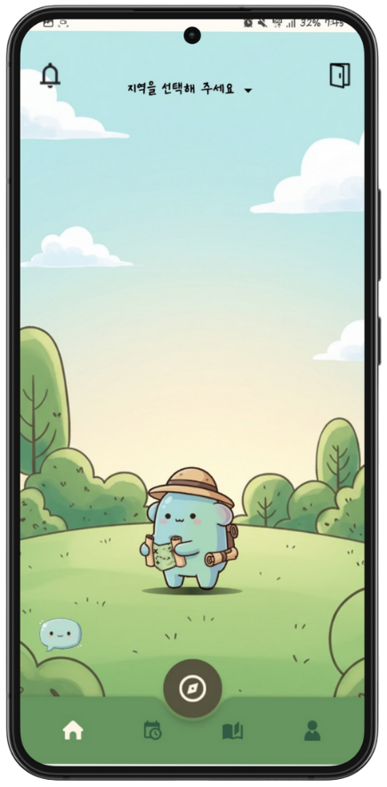
  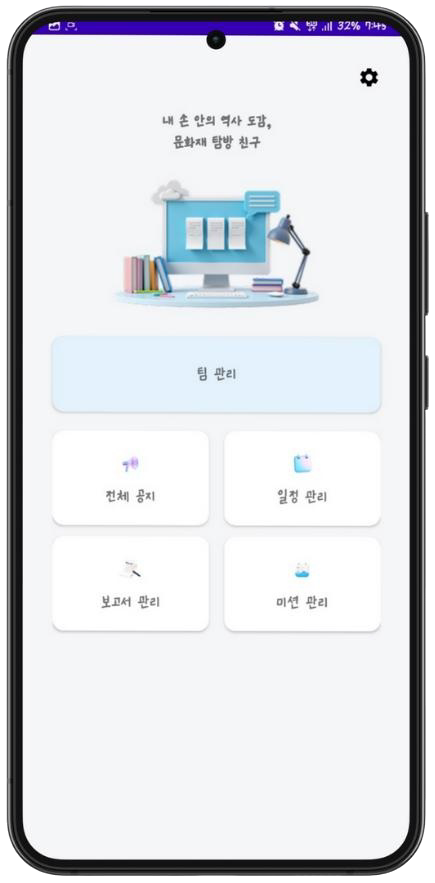

<i>[앱 메인 화면] 학생용(왼쪽) / 교사용(오른쪽)</i>

| 항목 | 내용 |
| --- | --- |
| 앱 이름 | 문방구 |
| 프로젝트 설명 | 초등학생과 교사의 현장학습 경험을 개선하는 교육용 앱 |
| 주요 기능 | GPS 기반 미션, 안전수칙 퀴즈, 학생들의 활동 추적, 만족도조사 자동화 |
| 개발 기간 | 25.01.06 ~ 25.02.22 (7주) |
| 팀 구성 | [손은주(BE, Leader)](https://github.com/handjoo) [제갈민(BE)](https://github.com/jgm00) [최대규(BE, Infra)](https://github.com/Daek-You) [김병년(FE)](https://github.com/KimByeongNyeon) [이용재(FE)](https://github.com/yongjae730) 박성민(FE) |  

<table>
  <tr>
    <th>분야</th>
    <th>기술</th>
  </tr>
  <tr>
    <td><code>Front-end</code></td>
    <td>
      
      
      
      
      
      
    </td>
  </tr>
  <tr>
    <td><code>Back-end</code></td>
    <td>
      
      
      
      
      
      
    </td>
  </tr>
  <tr>
    <td><code>Infra</code></td>
    <td>
      
      
      
      
      
    </td>
  </tr>
   <tr>
    <td><code>Cooperation</code></td>
    <td>
           
    </td>`
  </tr>
</table>

 

## 1. 프로젝트 소개

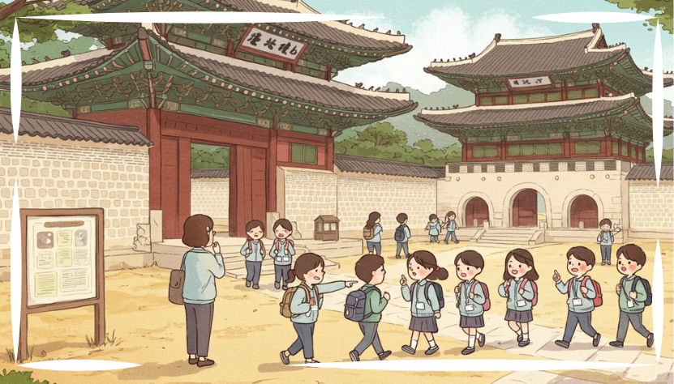

- 문방구는 초등학생과 교사를 위한 교육용 문화재 탐방 어플리케이션입니다.
- 학생은 GPS 기반 퀴즈와 미션을 수행하며 즐겁게 문화재를 학습할 수 있습니다.
- 교사는 학생들의 위치와 활동 상태를 파악하며 체계젹인 현장학습 관리가 가능합니다.

> <b>ℹ️[INFO]</b>  
> 실제로 잘 작동되는지 확인하기 위해, 직접 `경복궁`에 가서 테스트를 진행하였습니다.  

### 프로젝트의 필요성

- 저희는 <b>실제 현직 초등교사</b>와의 인터뷰를 통해 현장체험학습에서 겪는 다양한 문제점을 파악했습니다.
- 교사들은 다음과 같은 어려움을 공통적으로 언급했습니다.  

<table>
  <thead>
    <tr>
      <th><nobr>❌ 문제</nobr></th>
      <th>내용</th>
      <th>✅ 해결</th>
    </tr>
  </thead>
  <tbody>
    <tr>
      <td><nobr><b>실시간 공지 어려움</b></nobr></td>
      <td>학생들에게 공지사항을 빠르게 전달하기 어려움</td>
      <td>공지 및 알림 기능</td>
    </tr>
    <tr>
      <td><nobr><b>안전 교육 미흡</b></nobr></td>
      <td>출발 전에 실시하는 교육을 집중하지 않는 학생들이 많음</td>
      <td>안전수칙 O/X 퀴즈</td>
    </tr>
    <tr>
      <td><nobr><b>팀별 활동 통제 불가</b></nobr></td>
      <td>팀 단위 이동 시 위치·미션 파악 어려움</td>
      <td>조별 현황 확인 기능</td>
    </tr>
    <tr>
      <td><nobr><b>낮은 학습 몰입도</b></nobr></td>
      <td>단순 관람 중심으로 흥미 유발 부족</td>
      <td>카드 수집 기반 퀘스트</td>
    </tr>
    <tr>
      <td><nobr><b>문화재 지식 부족</b></nobr></td>
      <td>교사의 설명 능력 부족으로 학습 효과 감소</td>
      <td>문화재 백과사전 제공</td>
    </tr>
  </tbody>
</table>

- 문방구는 단순히 학습 도구를 넘어, <b>학생의 참여도와 교사의 관리 효율을 동시에 높이는 실용적인 교육 솔루션</b>을 목표로 합니다.  

 

## 2. 기능 소개
### 학생용 앱(MBG)
#### 1) 스플래시 화면 및 로그인 회원 가입 화면

<table>
  <tr>
    <td align="center"><b>회원가입</b></td>
    <td align="center"><b>로그인</b></td>
  </tr>
  <tr>
    <td></td>
    <td></td>
  </tr>
</table>

#### 2) 안전 수칙

  
   
  회원가입 시 안전 수칙 퀴즈를 진행하여 학생들이 숙지할 수 있도록 하였습니다.

#### 3) 메인 화면

<table>
  <tr>
    <td align="center"><b>팀 참가</b></td>
    <td align="center"><b>알림 공지</b></td>
  </tr>
  <tr>
    <td align="center"></td>
    <td align="center">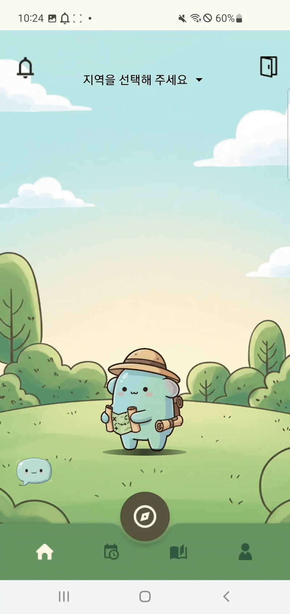</td>
  </tr>
  <tr>
    <td>선생님으로부터 받은 초대코드를 입력해 방에 입장할 수 있습니다.</td>
    <td>선생님이 설정한 일정 알림을 확인할 수 있습니다.</td>
  </tr>
  <tr>
    <td align="center"><b>공지 알림</b></td>
    <td align="center"><b>만족도 조사</b></td>
  </tr>
  <tr>
    <td align="center">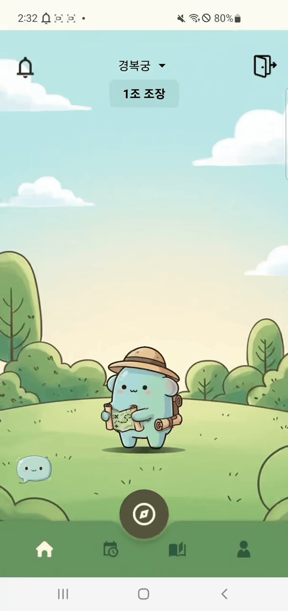</td>
    <td align="center"></td>
  </tr>
  <tr>
    <td>선생님이 공지한 알림을 확인할 수 있습니다.</td>
    <td>체험학습이 끝난 후, 간편하게 만족도 조사를 끝낼 수 있습니다.</td>
  </tr>
</table>

#### 4) 지도 및 게임 화면

<table>
  <tr>
    <td align="center"><b>지도</b></td>
    <td align="center"><b>미션 - 주관식 퀴즈</b></td>
  </tr>
  <tr>
    <td align="center">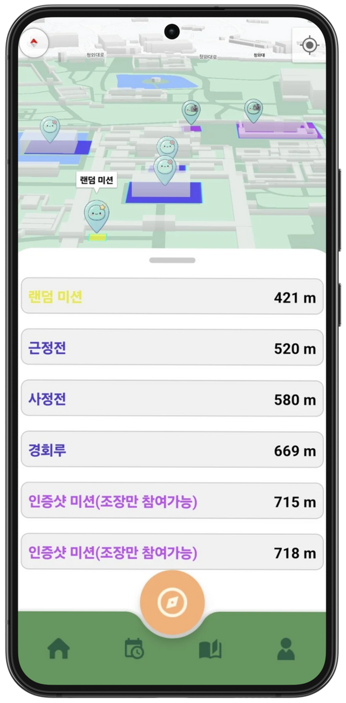</td>
    <td align="center">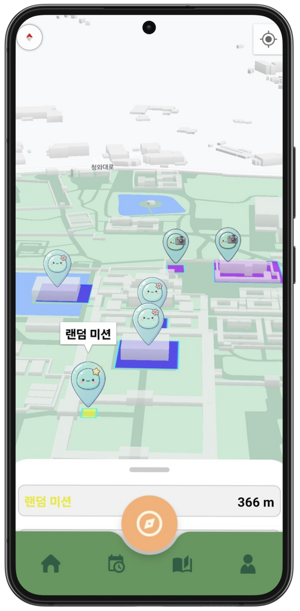</td>
  </tr>
  <tr>
    <td>현재 위치에서 가까운 순으로 미션 장소들을 보여줍니다.</td>
    <td>하루마다 얻을 수 있는 카드가 달라지는 주관식 퀴즈를 할 수 있습니다.</td>
  </tr>
  <tr>
    <td align="center"><b>미션 - 객관식 퀴즈</b></td>
    <td align="center"><b>미션 - 인증샷</b></td>
  </tr>
  <tr>
    <td align="center">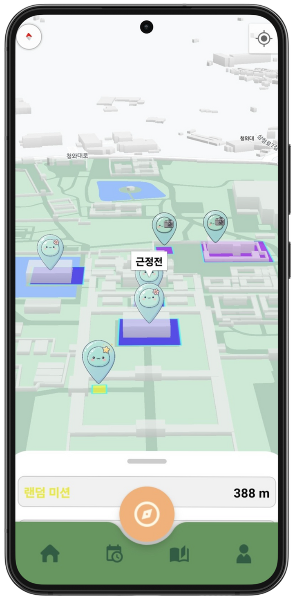</td>
    <td align="center">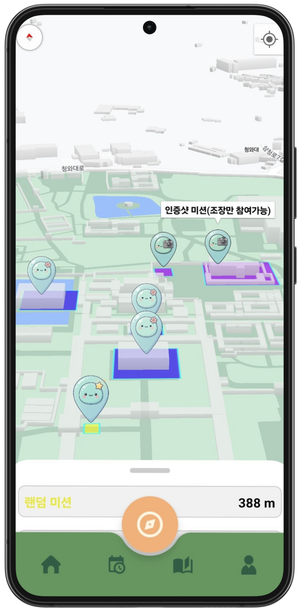</td>
  </tr>
  <tr>
    <td>특정 문화재에 대한 객관식 퀴즈를 풀고, 관련 카드를 얻을 수 있습니다.</td>
    <td>인증샷을 찍어야 하는 장소들을 보여줍니다.</td>
  </tr>
</table>

#### 5) 도감 화면

<table>
  <tr>
    <td align="center"><b>수집 아이템 확인</b></td>
  </tr>
  <tr>
    <td align="center"></td>
  </tr>
  <tr>
    <td>수집한 문화재 카드들을 볼 수 있는 도감입니다.</td>
  </tr>
</table>

#### 6) 꾸미백과

<table>
  <tr>
    <td align="center"><b>풀이 기록 확인</b></td>
  </tr>
  <tr>
    <td align="center">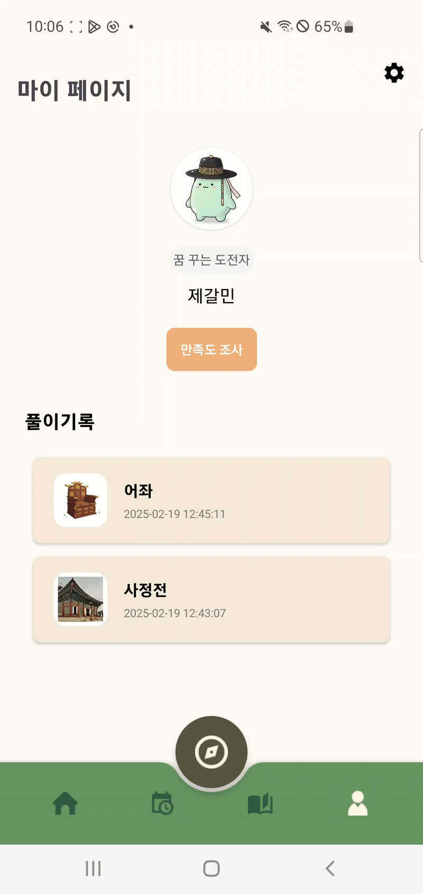</td>
  </tr>
  <tr>
    <td>풀었던 문제에 대한 문화재 정보를 자세하게 살펴볼 수 있습니다.</td>
  </tr>
</table>

 

### TMBG
#### 1) 팀 관리

<table>
  <tr>
    <td align="center"><b>반 생성</b></td>
    <td align="center"><b>그룹 상세 조회</b></td>
  </tr>
  <tr>
    <td align="center">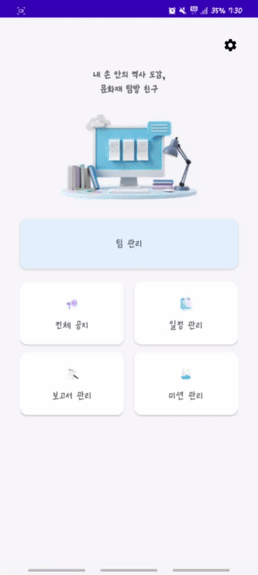</td>
    <td align="center">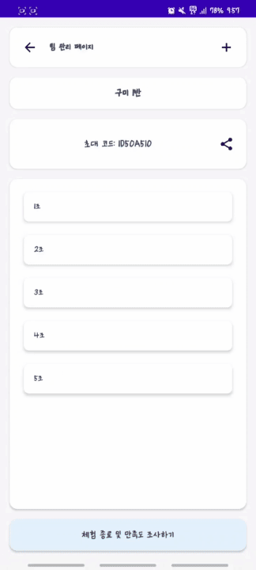</td>
  </tr>
  <tr>
    <td>현장 체험 학습을 진행할 반 정보를 생성할 수 있습니다.</td>
    <td>조별 인원과 미션 진행률, 인증샷 조회가 가능합니다.</td>
  </tr>
</table>

#### 2) 전체 공지

<table>
  <tr>
    <td align="center"><b>공지 생성</b></td>
  </tr>
  <tr>
    <td align="center">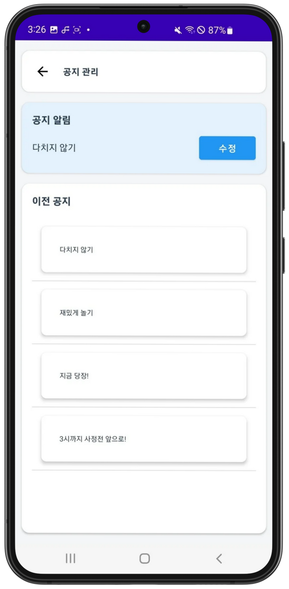</td>
  </tr>
  <tr>
    <td>학생들에게 보낼 공지를 생성하고, 이전에 생성했던 공지 조회가 가능합니다.</td>
  </tr>
</table>

#### 3) 일정 관리

<table>
  <tr>
    <td align="center"><b>일정 생성</b></td>
    <td align="center"><b>일정 조회</b></td>
  </tr>
  <tr>
    <td align="center">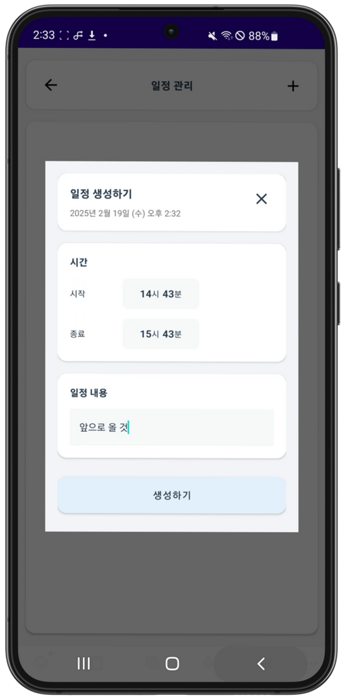</td>
    <td align="center">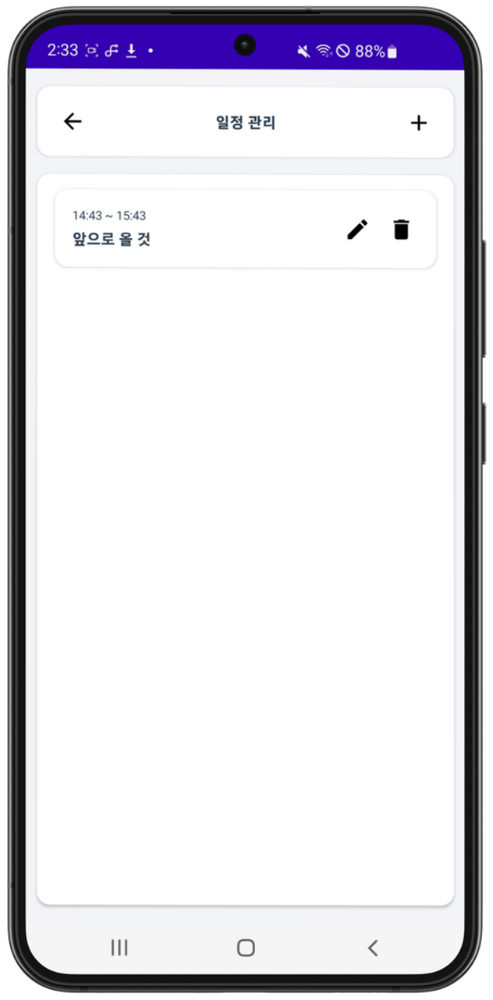</td>
  </tr>
  <tr>
    <td>일정을 생성할 수 있으며, 일정은 시작 10분 전에 학생들에게 알림이 전송됩니다.</td>
    <td>생성한 일정을 조회 및 삭제할 수 있습니다.</td>
  </tr>
</table>

#### 4) 보고서 관리

<table>
  <tr>
    <td align="center"><b>보고서 PDF 작성</b></td>
  </tr>
  <tr>
    <td align="center">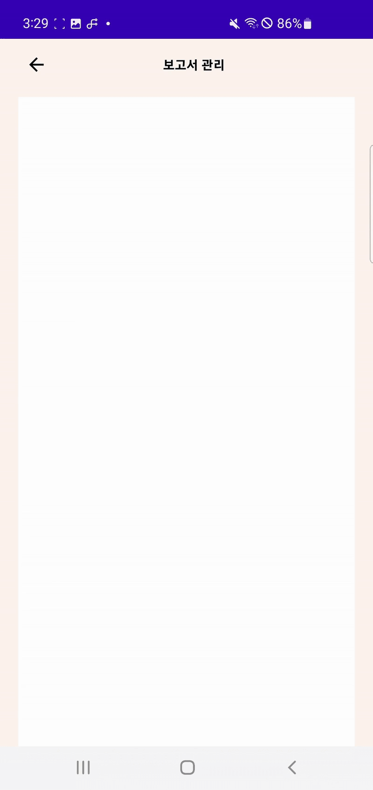</td>
  </tr>
  <tr>
    <td>만족도 조사를 실시할 수 있습니다.  만족도 조사를 완료한 학생을 확인할 수 있으며, 모든 학생이 완료하면 보고서가 생성됩니다.  "PDF로 내보내기" 클릭 시 파일을 받을 수 있으며 현장체험학습을 종료할 수 있습니다.</td>
  </tr>
</table>

 

## 3. 담당 역할
### Infra
- Docker를 활용한 애플리케이션 컨테이너화
- Jenkins를 활용한 Back-end CI/CD 구축
- Nginx Reverse Proxy 설정 및 HTTPS 프로토콜 적용
- AWS S3를 활용해 카드, 인증샷 등의 이미지 관리

### Back-end

- 회원가입 및 로그인, 마이페이지 API 개발
- 꾸미백과 API 개발
- 지도에 필요한 문화재 유적지 내 정보 조회 API 개발
- [Caffeine Cache](https://github.com/ben-manes/caffeine)를 도입해 동일 이미지 조회 속도 `107ms → 1ms`로 개선

## 4. 문제 해결

 

## 5. 프로젝트 아키텍처 및 ERD

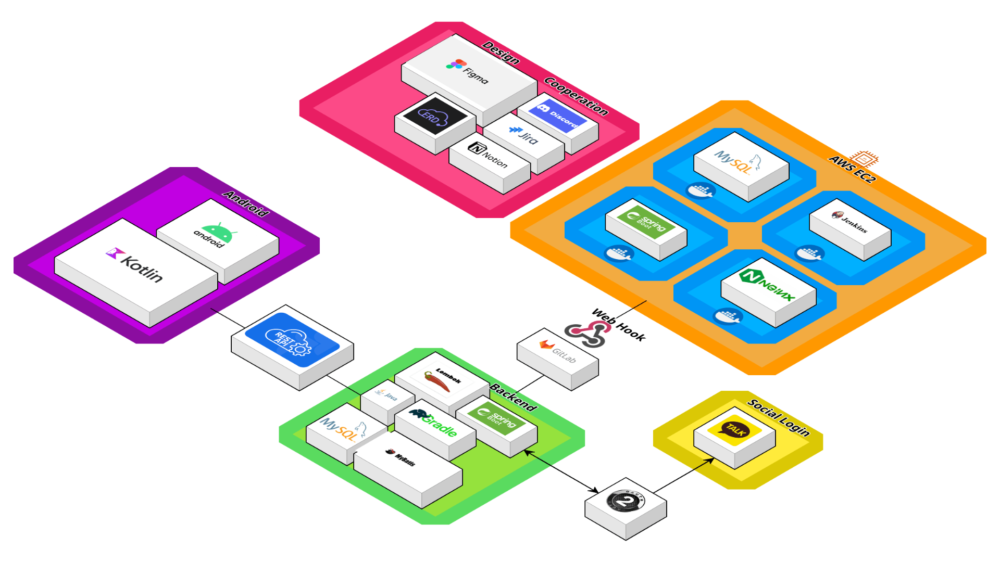
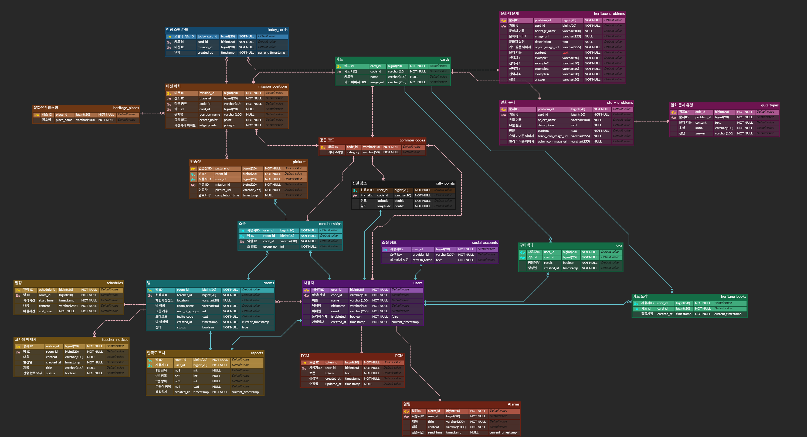
