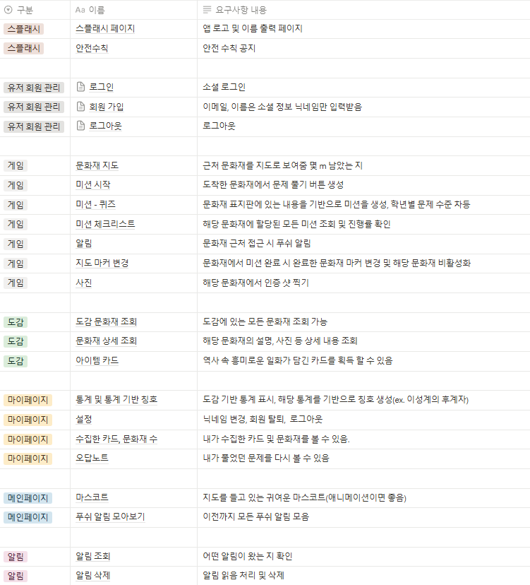

# 문방구 (문화재 탐방 친구)
> <b>"초등학생과 인솔자를 위한 교육용 문화재 탐방 어플"</b>  

  

## 1. 소개

현장학습에서 `학생`들은 <b>사진 인증의 번거로움, 단순 관람과 불분명한 학습 목적으로 인한 <u>지루함을 호소</u></b>하고 있으며, `인솔자`들은 <b><u>실시간 활동 현황 파악의 어려움과 체계적인 관리 도구의 부재</u></b>로 고민하고 있습니다. 이러한 문제를 해결하고자 GPS 위치 서비스와 게임적 요소를 접목한 새로운 교육용 앱을 기획하게 되었습니다. 학생들은 퀴즈와 미션을 해결하며 문화재를 즐겁게 배울 수 있고, 인솔자들은 실시간 모니터링과 체계적인 관리 도구를 활용할 수 있어 보다 효율적인 현장학습이 가능해질 것으로 기대됩니다.

## 2. 기능 소개
### 요구사항 명세서
  

## 3. 기대효과
### 3-1. 학생
#### 가. 교육적 효과 증대
- **학습의 흥미 유발**  
  게이미피케이션을 활용해 학생들이 재미있게 학습하며 문화재에 대한 관심을 자연스럽게 유도.
- **현장 체험 학습의 효율성 강화**  
  위치 기반 퀴즈 및 도감을 통해 방문한 문화재와 관련된 정보를 깊이 학습할 수 있는 기회 제공.
- **교과 내용과의 연계성 강화**  
  문제와 도감 콘텐츠를 교과 과정에 맞춰 설계하여 학업 성취도를 높임.
- **지속 가능한 학습 환경 조성**  
  학습 후에도 도감 및 리워드 시스템을 통해 지속적인 학습 동기 부여.

#### 나. 참여도와 협력 능력 향상
- **팀 기반 활동**  
  팀 랭킹 시스템, 릴레이 퀴즈 등을 통해 학생들 간 협력 및 소통을 장려.
- **협력과 참여의 증진 (소외 학생 고려)**  
  팀 기반 활동과 협력을 유도하여 소외되는 학생 없이 모두가 참여할 수 있는 환경 조성.  
  개인 맞춤형 난이도 조정과 힌트 기능을 통해 학습 능력에 차이가 있는 학생들도 자신감을 갖고 활동에 참여 가능.

#### 다. 문화재 관심 및 보존 인식 제고
- **문화재 탐방 촉진**  
  다양한 루트와 미션을 통해 학생들이 문화재에 대한 흥미를 느끼고 직접 방문하도록 유도.
- **문화재의 역사적 가치 재발견**  
  스토리라인 연결 및 도감 학습을 통해 학생들이 문화재의 역사적, 문화적 의미를 이해.

### 3-2. 교사(인솔자)
#### 가. 관리 효율성 증대
- **학생 안전 관리 강화**  
  실시간 학생별 진행도 파악을 통해 학생 동선을 철저히 관리하여 안전 관리를 강화할 수 있음.

#### 나. 현장학습 준비 부담 완화
- **편리한 현장 학습 관리**  
  코스 설정, 문제 난이도 조정, 반 내 팀 관리 등으로 활동을 사전에 효율적으로 계획하고 운영 가능.
- **보고서 자동화 지원**  
  현장학습 후 보고서를 자동 생성하여 사후 업무 부담 감소.

#### 다. 수업 효과 증대와 만족도 상승
- **학습의 의미 부여**  
  탐방 후 도감 완성과 리워드 제공으로 학생들에게 학습 동기를 지속적으로 부여
- **현장학습 만족도 향상**  
  재미있고 체계적인 학습 활동을 통해 학생과 학부모의 만족도를 높이며, 교사로서의 성과도 향상
- **팀 기반 활동 관리**  
  팀별 랭킹 및 점수 체계를 통해 협력 학습의 장을 제공하며, 팀워크 증진을 지원
- **학습과 재미의 균형**  
  게임적 요소와 교육적 목표가 조화를 이루어 학생들이 즐겁게 학습하도록 유도

## 4. 프로젝트 주간 개발 일지

| 날짜    | 전체                        | 김병년                 | 박성민                 | 손은주                 | 이용재                | 제갈민                  | 최대규                                    |
| ----- | ------------------------- | ------------------- | ------------------- | ------------------- | ------------------ | -------------------- | -------------------------------------- |
| 01.13 | 프로젝트 주제회의 및 개인 아이디어 발표    | gift-drop(보물찾기), 님섡 | ai선톡                | 타임 캡슐 일기            | 알바생 근태 관리 어플       | 구독관리 어플리케이션, 물류관리 어플 | 파킹고, 베뉴,우리 家 매니저                       |
| 01.14 | 컨설턴트 코치님 1차 사전 미팅         | gift-drop 아이디어 구체화  | ai선톡 아이디어 구체화       | gift-drop 아이디어 구체화  | gift-drop 아이디어 구체화 | gift-drop 아이디어 구체화   | 파킹고 아이디어 구체화                     |
| 01.15 | 아이디어 구체화                  | 문방구 기획 및 토론         | ai 페이스 메이커 아이디어 구체화 | 문방구 레퍼런스 문서 조사      | 문방구 기획 및 토론        | 문방구 기획및 토론           | hunt-zone(경찰과 도둑) 아이디어 구체화             |
| 01.16 | 컨설턴트 코치님 2차 미팅,요구사항 명세 논의 | 문방구 와이어 프레임 기획      | AI, AR 기술 적용을 위한 학습 | 생성형 AI를 이용한 캐릭터 디자인, 메인 화면 간략 디자인 | 문방구 와이어 프레임 기획     | 문방구 와이어 프레임 기획       | 요구사항 명세서 작성                            |
| 01.17 &nbsp; | 와이어 프레임 논의, Readme 작성     | JIRA로 일정 수립         | 페르소나 고민사항 작성        | JIRA로 일정 수립         | 페르소나 고민사항 작성       | 요구사항 명세 정리, 기대효과 작성  | Readme 템플릿 작성 및 취합, 페르소나 제작, 고객여정지도 작성 |
